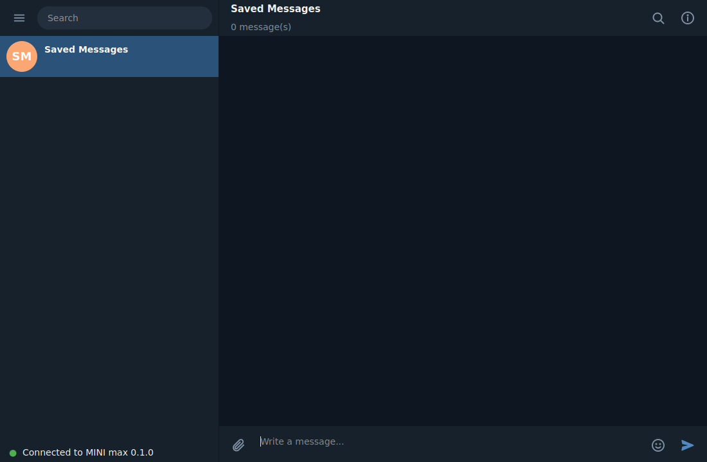
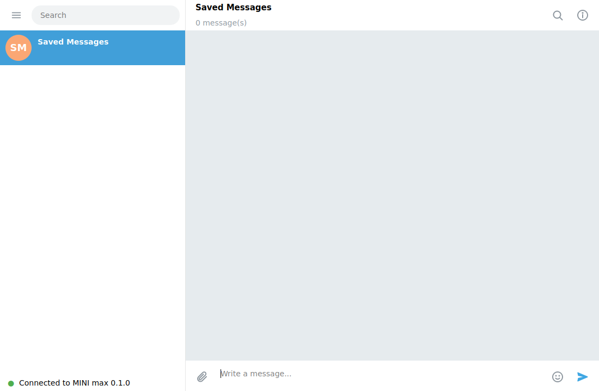
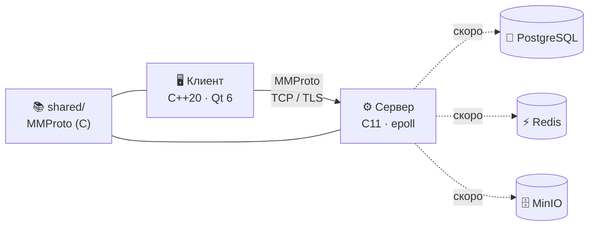

<div align="center">

# 💬 MINI&nbsp;max

### Быстрый, лёгкий и открытый мессенджер в стиле Telegram

**Сервер на C11 · Клиент на C++20 / Qt 6 · Собственный бинарный протокол MMProto**

[](https://github.com/YOUR_USER/minimax/actions/workflows/build.yml)


[🚀 Быстрый старт](#-быстрый-старт) · [🖼 Интерфейс](#-интерфейс) · [⚙️ Настройка](#️-настройка) · [🗺 Roadmap](#-roadmap) · [🧩 Архитектура](#-архитектура)

</div>

---

> [!NOTE]
> **MINI max — проект на ранней стадии (alpha).** Сейчас готов фундамент: сервер принимает соединения и говорит по протоколу MMProto, а клиент повторяет внешний вид Telegram Desktop (тёмная и светлая темы), подключается к серверу и показывает статус соединения. Регистрация, чаты между пользователями и медиа — в [Roadmap](#-roadmap). Ниже честно указано, что уже работает.

## ✨ Что уже работает

| | Возможность | Статус |
|---|---|:---:|
| 🖥 | Клиент Qt 6 в стиле Telegram Desktop: список чатов, область сообщений, панель профиля | ✅ |
| 🌗 | Тёмная / светлая / системная тема (палитры Telegram «Night» и «Day») | ✅ |
| 🔎 | Поиск по списку чатов, многострочный ввод (Enter — отправить, Shift+Enter — перенос) | ✅ |
| 📌 | Локальный чат «Saved Messages» с пузырями сообщений и временем | ✅ |
| 🔌 | Подключение к серверу по адресу из `client.toml`, handshake, keepalive, авто-reconnect с backoff | ✅ |
| 🔐 | TLS-режим клиента (проверка сертификата, свой CA) | ✅ |
| 📡 | Сервер: много соединений, лимиты, корректное завершение; epoll (Linux), Winsock/WSAPoll (Windows), poll (macOS/BSD) | ✅ |
| 🪟 | Сервер и клиент работают на **Windows** и Linux | ✅ |
| 🧾 | Протокол MMProto: кадры + TLV, юнит- и интеграционные тесты, прогон под ASan/UBSan в CI | ✅ |
| ⚙️ | Вся конфигурация только из TOML-файлов, ничего не зашито в код | ✅ |
| 👤 | Регистрация, вход, 2FA, пользовательские чаты, группы, каналы, медиа, боты, звонки, Stars/Gifts/Premium | 🛠 [в планах](#-roadmap) |

## 🖼 Интерфейс

<table>
<tr>
<td align="center"><b>🌙 Тёмная тема</b></td>
<td align="center"><b>☀️ Светлая тема</b></td>
</tr>
<tr>
<td></td>
<td></td>
</tr>
</table>

## 🚀 Быстрый старт

<details open>
<summary><b>🐧 Linux (Ubuntu / Debian)</b> — нажмите, чтобы свернуть</summary>

```bash
# 1. Зависимости
sudo apt install build-essential cmake ninja-build git python3 qt6-base-dev libqt6svg6-dev

# 2. Клонируем и собираем
git clone https://github.com/YOUR_USER/minimax.git
cd minimax
scripts/build.sh

# 3. Запускаем сервер (в одном терминале)
scripts/run-server.sh

# 4. Запускаем клиент (в другом терминале)
scripts/run-client.sh
```

В левом нижнем углу клиента появится зелёный индикатор **«Connected to MINI max 0.1.0»**.
</details>

<details>
<summary><b>📦 Готовая сборка из GitHub Actions</b></summary>

1. Откройте вкладку **Actions** → последний успешный запуск **build**.
2. Скачайте артефакт `minimax-linux-x86_64`.
3. Распакуйте: `tar xzf minimax-linux-x86_64.tar.gz && cd minimax`.
4. Запустите `./minimax-server -c configs/server.toml`, затем `./minimax-client -c configs/client.toml`.

Для запуска нужны системные библиотеки Qt 6: `sudo apt install qt6-base-dev libqt6svg6`.
Сборка для Windows лежит в соседнем артефакте `minimax-windows-x64` — см. раздел про Windows ниже.
</details>

<details open>
<summary><b>🪟 Windows (сервер и клиент)</b></summary>

**Вариант 1 — готовая сборка (проще всего)**

1. Откройте вкладку **Actions** → последний успешный запуск **build** → артефакт **`minimax-windows-x64`**
   (или раздел **Releases**, если есть релиз).
2. Распакуйте архив в любую папку.
3. Запустите **`start-server.bat`** — откроется окно сервера.
4. Запустите **`start-client.bat`** — откроется MINI max.

Адрес сервера меняется в `configs\client.toml` (параметры `host` и `port`).

**Вариант 2 — сборка из исходников (MSYS2)**

1. Установите [MSYS2](https://www.msys2.org/) и откройте оболочку **MSYS2 UCRT64**.
2. Установите зависимости и соберите:

```bash
pacman -S --needed git mingw-w64-ucrt-x86_64-toolchain mingw-w64-ucrt-x86_64-cmake \
  mingw-w64-ucrt-x86_64-ninja mingw-w64-ucrt-x86_64-python \
  mingw-w64-ucrt-x86_64-qt6-base mingw-w64-ucrt-x86_64-qt6-svg
git clone https://github.com/YOUR_USER/minimax.git && cd minimax
cmake -S . -B build -G Ninja -DCMAKE_BUILD_TYPE=Release
cmake --build build
build/server/minimax-server.exe -c configs/server.toml     # в одном окне
build/client/minimax-client.exe -c configs/client.toml     # в другом
```

При первом запуске брандмауэр Windows может спросить разрешение для сервера — для локальных тестов достаточно «частных сетей».
</details>

<details>
<summary><b>🍎 macOS</b></summary>

Клиент (Qt 6 + CMake) переносим; сервер на macOS/BSD использует переносимый `poll()` (не проверялся). Либо запустите сервер на Linux/Windows и укажите его адрес в `client.toml`.
</details>

<details>
<summary><b>🧪 Тесты</b></summary>

```bash
scripts/test.sh
```
Запускаются: проверка кодека MMProto, интеграционный тест сервера (HELLO, PING, ошибки, мусорные данные) и проверка разбора `client.toml`.
</details>

## ⚙️ Настройка

Адрес сервера **никогда не зашит в клиент** — он читается из `configs/client.toml` при каждом запуске.

```toml
# configs/client.toml
[server]
host = "127.0.0.1"
port = 7443

[tls]
enabled = false
verify_peer = true

[network]
keepalive_seconds = 20
reconnect_min_ms = 500
reconnect_max_ms = 15000

[ui]
theme = "dark"        # dark | light | system
cache_dir = "~/.cache/minimax"
```

Сервер настраивается в `configs/server.toml` (адрес, порт, лимиты, уровень логов, а также параметры PostgreSQL / Redis / MinIO / TLS для следующих этапов). Если обязательного ключа нет — сервер сразу сообщает, какого именно, и не запускается.

## 🧩 Архитектура



```text
minimax/
├── shared/    # протокол MMProto (C, используется и сервером, и клиентом)
├── server/    # сервер на C11 + SQL-миграции
├── client/    # клиент Qt 6 (config, net, core-модели, ui)
├── configs/   # server.toml, client.toml
├── scripts/   # build / test / run / migrate
└── docs/      # протокол, сборка
```

Подробности: [docs/protocol.md](docs/protocol.md) · [docs/build.md](docs/build.md)

## 🗺 Roadmap

- [x] Протокол MMProto, сервер на epoll, клиент Qt 6 с UI в стиле Telegram
- [x] Конфигурация из файлов, CI (сборка, тесты, ASan/UBSan)
- [x] Сервер и клиент на Windows и Linux
- [ ] TLS на стороне сервера (OpenSSL)
- [ ] Регистрация по номеру (код в логе сервера), вход, 2FA (Argon2id), сессии
- [ ] PostgreSQL / Redis: личные чаты, доставка и история сообщений, апдейты
- [ ] Группы, каналы, роли, приглашения
- [ ] Медиа через MinIO, поиск, реакции, ответы и пересылка
- [ ] Секретные чаты (X25519 + Double Ratchet)
- [ ] Боты (Bot API), Stars, Gifts, Premium
- [ ] Звонки (WebRTC)

## 🤝 Участие

Issues и pull request’ы приветствуются. Перед отправкой убедитесь, что `scripts/test.sh` проходит.

## 📄 Лицензия

Лицензия пока не выбрана — добавьте файл `LICENSE` перед публикацией.
